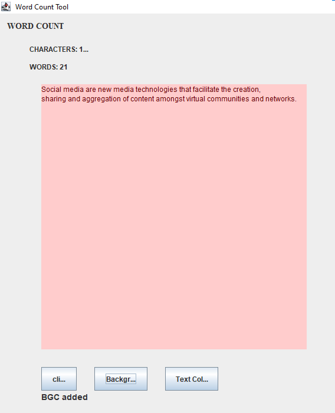

# Word Count Tool

A simple Java Swing application that counts characters and words in text with customizable colors.

## Screenshots

### Main Application Window


### Demo with Text


### Results Display


## Features

- **Character Count**: Displays the total number of characters in the text
- **Word Count**: Displays the total number of words in the text
- **Background Color**: Customize the text area background color
- **Text Color**: Customize the text color
- **User-friendly GUI**: Built with Java Swing for easy interaction

## Requirements

- Java Development Kit (JDK) 8 or higher
- Java Runtime Environment (JRE)

## How to Run

### Using Command Line

1. Clone the repository:
```bash
git clone https://github.com/[your-username]/[your-repo-name].git
cd [your-repo-name]
```

2. Compile the Java file:
```bash
javac src/count/CharCount.java
```

3. Run the application:
```bash
java -cp src count.CharCount
```

### Using Eclipse

1. Import the project into Eclipse
2. Right-click on `CharCount.java`
3. Select **Run As** → **Java Application**

## Usage

1. Type or paste text into the text area
2. Click the **click** button to calculate character and word count
3. Use **Background Color** button to change the text area background
4. Use **Text Color** button to change the text color

## Project Structure

```
.
├── src/
│   └── count/
│       └── CharCount.java
├── .gitignore
└── README.md
```

## License

This project is open source and available for educational purposes.
